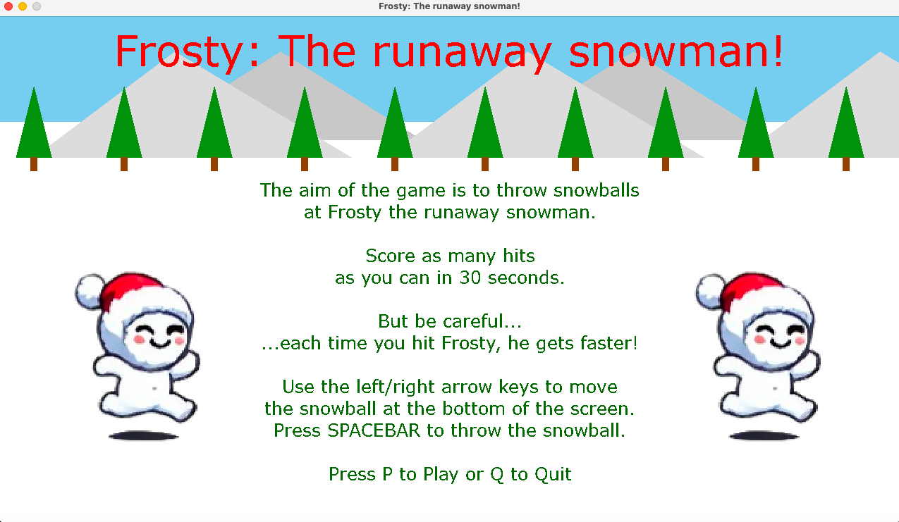

# Frosty: The runaway snowman!

Frosty the snowman is on the loose!

Throw as many snowballs as you can at Frosty in 30 seconds.

But be careful...each time you hit Frosty, he gets faster!

## Gameplay Mechanics:

### Movement

Use the left/right arrow keys to move the snowball at the bottom of the screen.

Press SPACEBAR to throw the snowball.

Press P to Play or Q to Quit.

### Health

The game starts with five health hearts in the top-left corner of the screen.

Hitting an obstacle (Santa, Elf, Reindeer, Bunny) reduces health by 1 heart.

### Timer

The player has 30 seconds to score as many snowball hits on Frosty as possible.

### Scoring

Total number of successful snowball hits on Frosty the snowman.

**Health Bonus:**
Earn **1 bonus point** for every health heart left at the end of the game.

**Time Bonus:**
If you hit Frosty 10 or more times, you will receive a time bonus.
The time bonus is calculated as the number of remaining seconds on the 10th successful hit.
Earn **1 bonus point** for every remaining second on the 10th hit.

The total score is calculated as follows:\
**TOTAL SCORE: No. of hits + Health bonus + Time bonus**

## Game demo

Click below to see the game in action!

## Game screenshots

**Welcome screen:**

**Gameplay:**

**Game Over:**

## Set-up

To ensure the game runs smoothly, follow the configuration steps below:

### Requirements/Dependencies

Refer to `requirements.txt` for all dependencies that need to be installed for the game to run successfully.

### Run

Run the `main.py` python file to start the game and snowball Frosty the runaway snowman!

## Credits

- Snowball spritesheet: [itch.io-Robert Brooks - gamedeveloperstudio.com](https://gamedeveloperstudio.itch.io/snowball)
- Frosty spritesheet:  "Sprites generated using ChatGPT by OpenAI."
- Santa and reindeer spritesheets: [itch.io-GatoAmarelo](https://gatoamarelo.itch.io/characters-for-christmas)
- Elf spritesheet: [itch.io-Millennial Voxel Forge](https://millennial-voxel-forge.itch.io/elf-hero)
- Bunny spritesheet: [itch.io-HRedBird](https://hredbird.itch.io/bunny-sprite-sheet)
- Heart health: [Wikipedia](https://en.m.wikipedia.org/wiki/File:Heart_left-highlight_jon_01.svg)
- Music: [itch.io-FablefLy Music](https://fablefly-music.itch.io/its-snowtime)