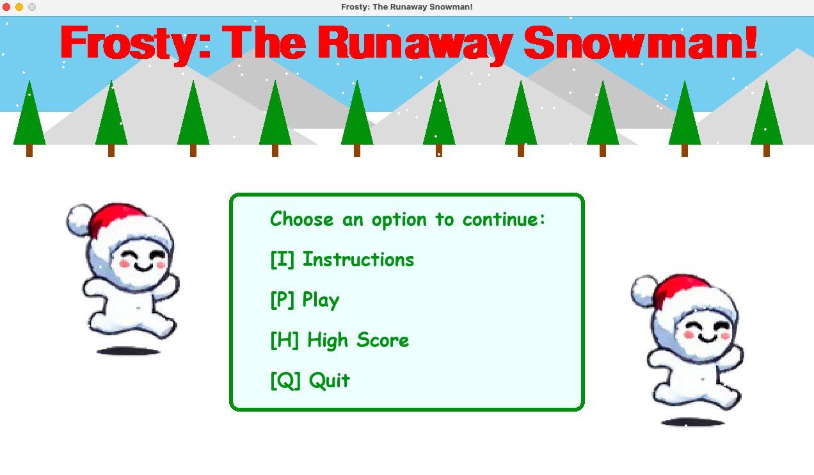
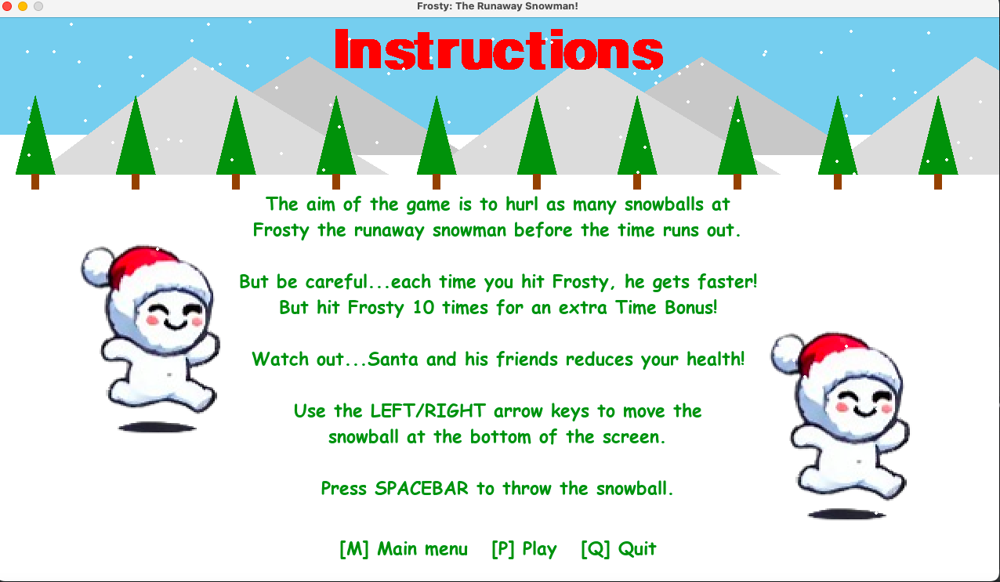
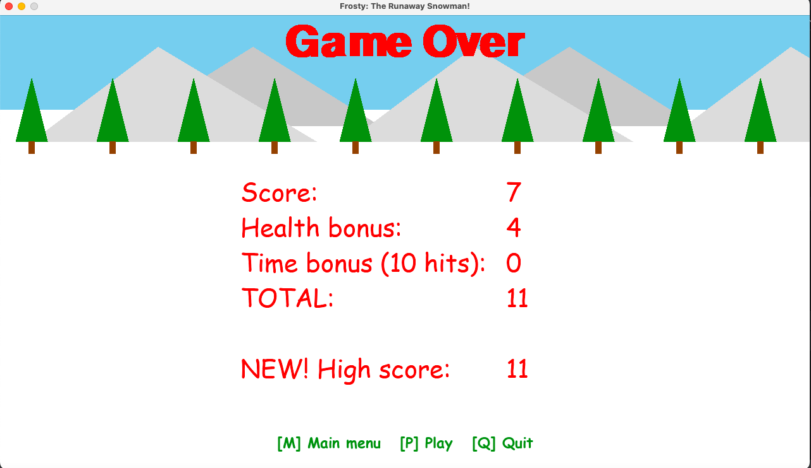

# Frosty: The Runaway Snowman!

Frosty the snowman has run away and is on the loose!

The aim of the game is to throw snowballs at Frosty before the time runs out.

But be careful...each time you hit Frosty, he gets faster!

👀 WATCH OUT! 👀 \
Santa and his friends reduces heart health — so aim wisely and have fun!

## Gameplay Mechanics:

### Movement

Use the keyboard for game play.

Use the **LEFT/RIGHT** arrow keys to move the snowball at the bottom of the screen.

Press **SPACEBAR** to throw the snowball.

### Health

The game starts with five health hearts in the top-left corner of the screen.

Hitting Santa or his friends (_elves/reindeers/bunnies_) reduces health by 1 heart.

### Timer

The player has 30 seconds to score as many Frosty snowball hits as possible.

### Scoring

**Score:**\
Total number of snowball hits on Frosty the runaway snowman.

**Health Bonus:**\
Earn **1 bonus point** for every health heart left at the end of the game.

**Time Bonus:**\
Hitting Frosty **10 or more times** receives a time bonus.

Time bonus is calculated as the number of remaining seconds on the 10th successful hit.\
Earn **1 bonus point** for every remaining second on the 10th hit.

**TOTAL SCORE:**
**Total Score = Score + Health Bonus + Time Bonus**

## Game demo

Click below to see the game in action!

## Game screenshots

<table bgcolor="#00000F">
    <tbody>
        <tr>	
            <th>Main menu</th>
            <th>Instructions</th>
            <th>High Score</th></tr>
        <tr>         
            <td></td>
            <td></td>
            <td></td></tr>
        <tr>
            <th>Gameplay</th>
            <th>Naughty Naughty!</th>
            <th>Game Over</th></tr>            
        <tr>
            <td></td>
            <td></td>
            <td></td></tr>
</tbody></table>

## Set-up

To ensure the game runs smoothly, follow the configuration steps below:

### Requirements/Dependencies

Refer to `requirements.txt` for all dependencies that need to be installed for the game to run successfully.

### Run

Run the `main.py` python file to start the game and snowball Frosty the runaway snowman!

## Credits

- Snowball spritesheet: [itch.io-Robert Brooks - gamedeveloperstudio.com](https://gamedeveloperstudio.itch.io/snowball)
- Frosty spritesheet:  "Sprites generated using ChatGPT by OpenAI."
- Santa and reindeer spritesheets: [itch.io-GatoAmarelo](https://gatoamarelo.itch.io/characters-for-christmas)
- Elf spritesheet: [itch.io-Millennial Voxel Forge](https://millennial-voxel-forge.itch.io/elf-hero)
- Bunny spritesheet: [itch.io-HRedBird](https://hredbird.itch.io/bunny-sprite-sheet)
- Heart health: [Wikipedia](https://en.m.wikipedia.org/wiki/File:Heart_left-highlight_jon_01.svg)
- Music: [itch.io-FablefLy Music](https://fablefly-music.itch.io/its-snowtime)
- Snowball hit: [piixabay-Alex_Jauk](https://pixabay.com/users/alex_jauk-16800354/?utm_source=link-attribution&utm_medium=referral&utm_campaign=music&utm_content=279699)